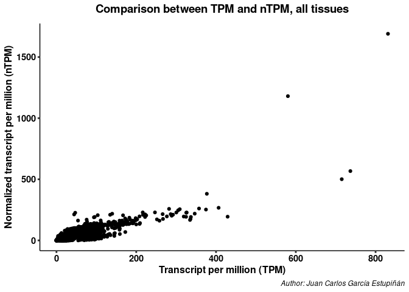
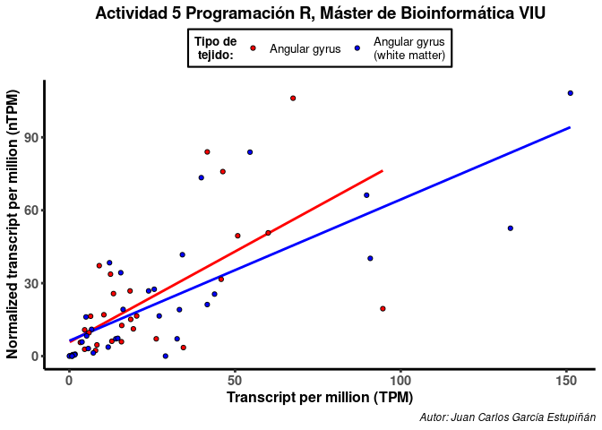
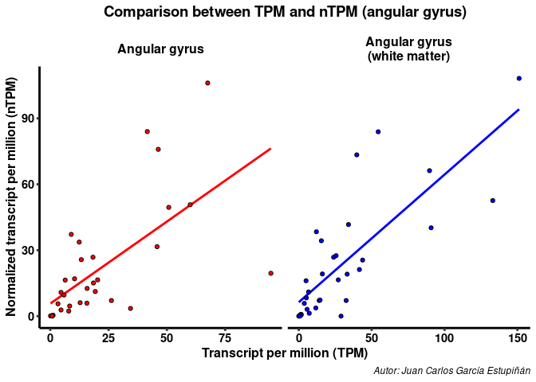

Actividad_R
================
Juan Carlos García Estupiñán
2022-11-28

# En caso de algún problema con el código, adjunto el repositorio donde lo he almacenado en mi cuenta de [GitHub](https://github.com/Juankkar/Programacion_Python_R).

## Resultado en Markdown: [documents](https://github.com/Juankkar/Programacion_Python_R/blob/main/Actividad_R/documents)

# Actividad - Programación en R

Esta actividad evaluada consiste en una serie de ejercicios que debe
responder dentro de los *chunks* o trozos de código disponibles después
de cada pregunta. Recuerda incluir la carga de los paquetes necesarios
para la ejecución del código.

## Librerías a usar:

``` r
# Paquetes necesarios
packages <- c("tidyverse", "seqinr", "glue")

# Instalamos los paquetes 
installed_packages <- packages %in% rownames(installed.packages())
if (any(installed_packages == FALSE)){
  install.packages(packages[!installed_packages])
}
# Cargar las librarías
invisible(lapply(packages, library, character.only = TRUE))
```

    ## ── Attaching packages ─────────────────────────────────────── tidyverse 1.3.2 ──
    ## ✔ ggplot2 3.4.0      ✔ purrr   1.0.0 
    ## ✔ tibble  3.1.8      ✔ dplyr   1.0.10
    ## ✔ tidyr   1.2.1      ✔ stringr 1.5.0 
    ## ✔ readr   2.1.3      ✔ forcats 0.5.2 
    ## ── Conflicts ────────────────────────────────────────── tidyverse_conflicts() ──
    ## ✖ dplyr::filter() masks stats::filter()
    ## ✖ dplyr::lag()    masks stats::lag()
    ## 
    ## Attaching package: 'seqinr'
    ## 
    ## 
    ## The following object is masked from 'package:dplyr':
    ## 
    ##     count

# Parte 1 (evaluacionR.csv)

## Pregunta 1.

Descargar el archivo evaluacionR.csv e importar dicha información a un
dataframe identificado como **df** usando el url que se indica en el
trozo de código.

``` r
url1 <- "https://www.dropbox.com/s/ms29mvjj0pdq9oz/evaluacionR.csv?dl=1"
fichero <- "../data_raw/df.csv"
sistema_operativo <- "linux" # Poner si se encuenctra en windows o linux
# # Windows
# # download.file(url,"../data_raw/df.csv", method="wininet")
# # Linux
if(sistema_operativo == "linux" && !file.exists(fichero)){
  download.file(url1,fichero, method="wget")
  print("Has descargado los datos para Linux")
} else if(sistema_operativo == "windows" && !file.exists(fichero)){
  ### No funciona muy bien en Windows esta condicion por las rutas
  download.file(url1,fichero, method="wininet") 
  print("Has descargado los datos para Windows")
} else{
  print("Los datos ya estaban descargados")
}
```

    ## [1] "Los datos ya estaban descargados"

``` r
# Datos
df <- read.csv(file = "../data_raw/df.csv")
```

## Pregunta 2.

¿Cuál es el tipo de cada una de las variables presentes en el dataframe
**df**?

``` r
## Vemos los tipos de objetos
lapply(df, typeof)
```

    ## $X
    ## [1] "integer"
    ## 
    ## $Gene
    ## [1] "character"
    ## 
    ## $Gene.name
    ## [1] "character"
    ## 
    ## $Tissue
    ## [1] "character"
    ## 
    ## $TPM
    ## [1] "double"
    ## 
    ## $pTPM
    ## [1] "double"
    ## 
    ## $nTPM
    ## [1] "double"

## Pregunta 3.

¿Cuántos registros (filas) y variables (columnas) tiene el dataframe
**df?**

``` r
rows <- nrow(df)
cols <- ncol(df)

vector_respuesta <- c(nfilas=rows, ncolumnas=cols) 
vector_respuesta
```

    ##    nfilas ncolumnas 
    ##      8192         7

## Pregunta 4.

Agrupar el dataframe **df** por la variable **Tissue** y agregar
columnas con la media de TPM, el valor máximo de TPM y el valor mínimo
de TPM para cada tipo de Tissue. Almacenar el resultado en **df1**.

``` r
df1 <- df %>%
      group_by(Tissue) %>%
      summarise(media=mean(TPM),
                maximo=max(TPM),
                minimo=min(TPM))
df1 %>% head()
```

    ## # A tibble: 6 × 4
    ##   Tissue                                        media maximo minimo
    ##   <chr>                                         <dbl>  <dbl>  <dbl>
    ## 1 adipose tissue                                 34.6  282.     0  
    ## 2 adrenal gland                                  24.8  108.     0  
    ## 3 amygdala                                       21.3  104.     0.2
    ## 4 angular gyrus                                  21.2   94.6    0.1
    ## 5 angular gyrus (white matter)                   30.4  151.     0  
    ## 6 anterior cingulate cortex, supragenual-dorsal  17.9   75      0.2

## Pregunta 5.

Mostrar mediante un gráfico de puntos la relación entre TPM y nTPM
usando el dataframe **df**.

``` r
df %>%
      ggplot(aes(TPM, nTPM)) +
      geom_point(size=1.5) +
      labs(
        title = "Comparison between TPM and nTPM, all tissues",
        caption = "Author: Juan Carlos García Estupiñán",
        x="Transcript per million (TPM)",    # He estado buscando informacion sobre esto y creo que es a lo que se refiere con TPM
        y="Normalized transcript per million (nTPM)"
      ) +
      theme_classic() +
      theme(
        plot.title = element_text(face = "bold", size = 14, 
                                  hjust = .5, margin = margin(b = 10)),
        plot.caption = element_text(face = "italic"),
        axis.ticks = element_line(size = 1),
        axis.title = element_text(face = "bold", size = 12),
        axis.text = element_text(face = "bold", size = 11, color="black")
      )
```

<!-- -->

## Pregunta 6.

A partir de los datos de **df**, mostrar mediante un gráfico de puntos
la relación entre TPM y nTPM para los registros en donde la variable
Tissue sea igual a “angular gyrus (white matter)” o igual a “angular
gyrus”. Colorear de forma distinta dependiendo del tipo de Tissue.

``` r
## Esqueleto principal de los siguienets gráifcos
plot_6_y_7 <- df %>% 
  filter(Tissue == "angular gyrus (white matter)" | 
         Tissue == "angular gyrus") %>%
  mutate(Tissue=factor(Tissue,
                       levels = c("angular gyrus",
                                  "angular gyrus (white matter)"),
                       labels = c("Angular gyrus",
                                  "Angular gyrus\n(white matter)"))) %>%
  ggplot(aes(TPM, nTPM, fill=Tissue)) +
  geom_smooth(method = "lm", aes(color=Tissue), 
              se=FALSE, show.legend = FALSE) +
  scale_fill_manual(name="Tipo de\ntejido:",
                    values=c("red", "blue")) +
  scale_color_manual(name=NULL,
                         values=c("red", "blue")) +
  theme_classic() +
  theme(
    plot.title = element_text(face = "bold", size = 14, hjust = .5,
                              margin = margin(b = 10)),
    plot.caption = element_text(face = "italic"),
    axis.line=element_line(size = 1),
    axis.ticks = element_line(size = 1),
    axis.title = element_text(face = "bold", size = 12),
    axis.text = element_text(face = "bold", size = 11, color="black"),
    legend.title = element_text(face="bold",size = 10,hjust = .5),
    legend.text = element_text(size = 10, hjust = .5),
    legend.position = "top",
    legend.background = element_rect(color = "black", size = .75)
        )
```

    ## Warning: The `size` argument of `element_rect()` is deprecated as of ggplot2 3.4.0.
    ## ℹ Please use the `linewidth` argument instead.

``` r
## Gráfico de la actividad 5
plot_6_y_7 +
  geom_point(pch=21, color="black", size=1.5) +
  labs(
        title = "Comparison between TPM and nTPM (angular gyrus)",
        caption = "Autor: Juan Carlos García Estupiñán",
        x="Transcript per million (TPM)",
        y="Normalized transcript per million (nTPM)"
      ) 
```

    ## `geom_smooth()` using formula = 'y ~ x'

<!-- -->

## Pregunta 7.

Mostrar los mismos datos de la pregunta 6 usando facet_grid para separar
la información de los dos tejidos en dos gráficos colocados uno al lado
del otro.

``` r
plot_6_y_7 +
  geom_point(pch=21, color="black", size=1.5,
             show.legend = FALSE) +
  facet_grid(~Tissue, scales = "free") +
  labs(
        title = "Comparison between TPM and nTPM (angular gyrus)",
        caption = "Autor: Juan Carlos García Estupiñán",
        x="Transcript per million (TPM)",
        y="Normalized transcript per million (nTPM)"
      ) +
  theme(
    strip.background = element_blank(),
    strip.text = element_text(color = "black", size = 12, face = "bold")
  )
```

    ## `geom_smooth()` using formula = 'y ~ x'

<!-- -->

# Parte 2 (ncrna_NONCODE\[v3.0\].fasta)

## Pregunta 8.

Descargar el archivo ncrna_NONCODE\[v3.0\].fasta e importar los datos
usando el paquete seqinr visto en las prácticas de las últimas sesiones.
Recuerde que el archivo se encuetra comprimido. Almacenar los datos en
el objeto **ncrna**.

``` r
url2 <- "http://noncode.org/datadownload/ncrna_NONCODE[v3.0].fasta.tar.gz"

if (!file.exists("../data_raw/ncrna_NONCODE[v3.0].fasta")){
  url=url2      
  temp=tempfile()
  download.file(url,temp,method = "auto", quiet = TRUE)
  untar(temp,list=TRUE)
  untar(temp,exdir="../data_raw")
  unlink(temp)
  rm(temp,url)
} else{
  print("La base de datos ya estaba descargada")
}
```

    ## [1] "La base de datos ya estaba descargada"

``` r
ncrna <- read.fasta(file = "../data_raw/ncrna_NONCODE[v3.0].fasta")
```

## Pregunta 9.

Revisar las funciones disponibles del paquete seqinr. Indicar qué
función se puede utilizar para ver el listado y una breve descripción de
las funciones incluidas en el paquete.

``` r
library(help="seqinr")
```

## Pregunta 10.

Extraer en un objeto **secuencia** todas las secuencias del objeto
**ncrna** usando la función **getSequence** de seqinr. ¿de qué tipo es
el objeto **secuencia**?

``` r
secuencia <- getSequence(ncrna)
typeof(secuencia) # Se trata de una lista
```

    ## [1] "list"

## Pregunta 11.

Extraer las secuencias que empiezan con “acct”. ¿Cuántas secuencias
cumplen con la condición?

``` r
## En esta ocasión vamos a usar una función llamada scan, sirve para leer data que no
## tiene por que ser rectangular, tiene una opción de sep que nos permite separar por líneas
## lo que nos hace obtener un vector en el que cada valor son estas \n. En mi caso que 
## estoy más acostumbrado a usar vectores y df antes que listas me facilita el trabajo. 
## Además a mi ordenador le cuesta trabajar con listas tan largas, con vectores es más rápido.
ncrna_no_list <- scan("../data_raw/ncrna_NONCODE[v3.0].fasta",
                      what = character(),
                      quiet = TRUE,
                      sep = "\n")

## Eliminaos el primer y segundo elemento, debido a que son la presentación
## de los header y secuencias, no estos en sí.
ncrna_vect_preprocesado <- ncrna_no_list[-c(1,2)]
## Calculamos la longitud del vector, necesario para las condiciones
longitud_ncrna_vector <- length(ncrna_vect_preprocesado)

## Básicamente crearemos un vector que vaya desde la posición 1 (primer header) hasta el último, 
## ya que con seq() le hemos puesto que seleccione cada 2 líneas.
headers <- ncrna_vect_preprocesado[seq(1,longitud_ncrna_vector,2)]

## Lo mismo para las secuencias, pero en este caso empiezamos en el valor 2 (primera secuencia) del
## vector, seleccionando de nuevo 2 a 2. 
secuencias <- ncrna_vect_preprocesado[seq(2,longitud_ncrna_vector,2)]

## Deberían tener la misma longtud ambos en ese sentido
length(headers) == length(secuencias)
```

    ## [1] TRUE

``` r
## Y creamos un tibble con header como columna 1 (podríamos incluso partir este campo en varios)
## y secuencia como columna 2 
df_ncrna <- tibble(
    headers=headers,
    secuencias=secuencias
  ) %>%
  mutate(
    ## Vamos a convertir las secuencias en minúsculas
    secuencias=tolower(secuencias)
  )
df_ncrna %>% print(n=10)
```

    ## # A tibble: 411,552 × 2
    ##    headers                                                               secue…¹
    ##    <chr>                                                                 <chr>  
    ##  1 >n1 | AB002583 | tmRNA | chloroplast Cyanidioschyzon merolae | ssrA … acctcg…
    ##  2 >n2 | AB002583 | RNase P RNA | chloroplast Cyanidioschyzon merolae |… aaggca…
    ##  3 >n3 | AB003477 | tmRNA | Synechococcus sp | 10Sa | NONCODE v2.0 | NU… ggggct…
    ##  4 >n4 | AB007644 | snoRNA | Arabidopsis thaliana (thale cress) | U3 | … acgacc…
    ##  5 >n5 | AB009049 | snoRNA | Arabidopsis thaliana (thale cress) | U24 |… ggccgg…
    ##  6 >n6 | AB009051 | snRNA | Arabidopsis thaliana (thale cress) | U6 | N… gtccct…
    ##  7 >n7 | AB010698 | snRNA | Arabidopsis thaliana (thale cress) | U6 | N… gtccct…
    ##  8 >n9 | AB013387 | snoRNA | Arabidopsis thaliana (thale cress) | U3 | … acgacc…
    ##  9 >n10 | AB013390 | snRNA | Arabidopsis thaliana (thale cress) | U2 | … atacct…
    ## 10 >n11 | AB013396 | snRNA | Arabidopsis thaliana (thale cress) | U2 | … atacct…
    ## # … with 411,542 more rows, and abbreviated variable name ¹​secuencias

El siguiente chunk sería ya el ejercicio 11 resuelto.

``` r
## Filtramos las secuencias que empiezan por acct
seq_start_acct <- df_ncrna %>% filter(str_detect(secuencias, "^acct"))
## Vemos las 5 primeras filas que empiezan en acct:
seq_start_acct %>% select(secuencias) %>% head(n=5)
```

    ## # A tibble: 5 × 1
    ##   secuencias                                                                    
    ##   <chr>                                                                         
    ## 1 acctcgaccacccttaacttgggtgcaggtattcaacaaaagcaatgaatcaaggaatgaatcaatggattttcaat…
    ## 2 acctagtttttttaactaaaagttgagaaggctagggaacaccatttatttcatattaagatggaagacaagaaatg…
    ## 3 acctctcaaagctcatagctttgatcaagtgtagtatctgttcttgtcagtgtgacagctgacaaactagctccttg…
    ## 4 acctgcggtgcaaaacatcataatctagaagaaacaaactaatttcttccagataatctattatgcttttttttttt…
    ## 5 acctatcggcaaaaaacacaagcagttgtactaacatcaaacagatttttttttttttttt

``` r
## Vemos el total de las secuencias anteriores con length()
nrow(seq_start_acct) ## Se podría usar length(seq_start_acct$secuencia) también
```

    ## [1] 650

## Pregunta 12.

Extraer las secuencias que terminan con “tttttt”. ¿Cuántas secuencias
cumplen con la condición?

``` r
## Filtramos las secuencias que terminan por tttttt
seq_end_tttttt <- df_ncrna %>% filter(str_detect(secuencias, "tttttt$"))
## Vemos las 5 primeras filas que terminan en tttttt:
seq_end_tttttt %>% select(secuencias) %>% head(n=5)
```

    ## # A tibble: 5 × 1
    ##   secuencias                                                                    
    ##   <chr>                                                                         
    ## 1 gtcccttcggggacatccgataaaattggaacgatacagagaagattagcatggcccctgcgcaaggatgacacgca…
    ## 2 gtcccttcggggacatccgataaaattggaacgatacagagaagattagcatggcccctgcgcaaggatgacacgca…
    ## 3 gtcccttaggggacatccgataaaattggaacgatacagagaagattagcatggcccctgcgcaaggatgacacgca…
    ## 4 gtgcttgccttggtagcgcatatactaaagctggaatgatacagagaagtttagcatggcccctgaacaaggatgac…
    ## 5 gagtttgcttcagcagcaagtgtactaaaattaaaacaatatagagaagattagcatgatccctgcacaagtgtgac…

``` r
## Vemos el total de las secuencias anteriores del df
nrow(seq_end_tttttt) 
```

    ## [1] 728
